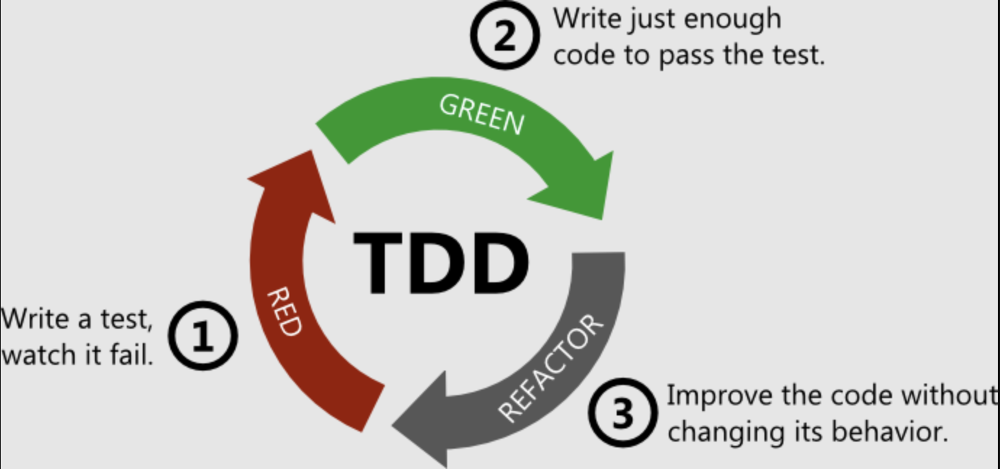

# Exercice

Implémenter le calcul de la date de la prochaine relance en [TDD](https://en.wikipedia.org/wiki/Test-driven_development#:~:text=Test%2Ddriven%20development%20(TDD),with%20another%20new%20test%20case.). 

## Workflow

## Règles métier :

- Pas de relance s’il s’agit d’un transfert sortant
- Pas de relance si le Transfert est terminé
- Pas de relance si c’est à la compagnie “Entrante” de travailler (states Verts)
- La prochaine relance doit avoir lieu 30 jours après la dernière action sur le Transfert
- Les relances doivent être espacées de 15 jours
